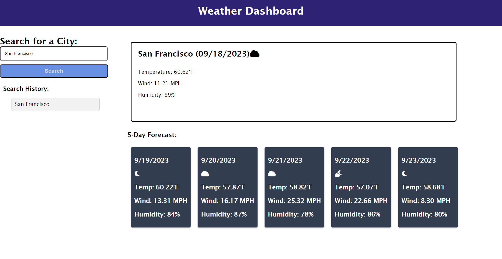

# WeatherTracker

## Description

The reason I built this project is because when someone is planning a trip they can look up the city they are going to check the weather in order to pack properly
for that condition.
Building this project I learned to implement APIs into the website.

## Usage

When the user searches for a ciity the weather conditions will appear for the current day and also for the next five days.
The user will also be able to see the previous searches and interact with them.

https://josuehernand.github.io/WeatherTracker/

## Credits

Worked with Raymond Bautista https://github.com/Raymond2811

## License

Used the MIT License
